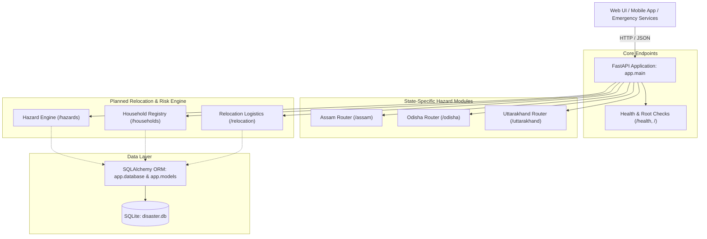

# 🛡️ Project AASRA (Disaster Resilience & Relocation API)

> **AASRA** (आसरा — *meaning "Shelter" or "Refuge"*) is a specialized backend platform designed for disaster risk assessment, hazard vulnerability mapping, and systematic relocation planning for at-risk populations.

---

## 📌 Executive Summary

Disasters such as flash floods, landslides, cyclones, and river surges displace millions of people annually across vulnerable geographies. **Project AASRA** provides a unified, data-driven API backend to assist emergency management authorities, NGOs, and planners in:
1. **Assessing Regional Hazards**: Tracking localized hazard severity across high-risk states (e.g., Assam, Odisha, Uttarakhand).
2. **Profiling Vulnerable Households**: Tracking families, vulnerability metrics, and immediate support requirements.
3. **Optimizing Relocation**: Organizing shelter capacities and executing relocation strategies to move vulnerable communities before and during disasters.

---

## 🏛️ Architecture & System Design

The project is built on **FastAPI**, offering asynchronous request handling, automatic OpenAPI schema generation, and integration with **SQLAlchemy** for database persistence.



---

## 📂 Project Structure

```text
D:\Aasra\AASRA\
├── app/
│   ├── __init__.py             # Package initializer
│   ├── database.py             # SQLite engine, SessionLocal, Base, get_db()
│   ├── main.py                 # FastAPI application, startup DB init & sync
│   ├── models.py               # SQLAlchemy ORM models (Household, RelocationCenter, HazardAssessment)
│   ├── init_db.py              # Idempotent database table initialization script
│   ├── seed_db.py              # Idempotent demographic & shelter database seeder
│   ├── routers/                # State regional hazard routers (assam, uttarakhand, odisha)
│   ├── routes/                 # Core API route controllers:
│   │   ├── assessment.py       # Disaster Assessment & Relocation Decision Engine
│   │   ├── gis.py              # GeoJSON FeatureCollection endpoints for map layers
│   │   ├── hazards.py          # Multi-hazard scoring, DEM 30m terrain, exposure
│   │   ├── households.py       # SQLite demographic registry, vulnerability scoring
│   │   └── relocation.py       # SQLite shelter management & evacuation routing
│   ├── services/               # Core computational & geospatial services:
│   │   ├── assessment.py       # End-to-end evaluation & SQLite caching
│   │   ├── data_loader.py      # Spatial GeoJSON, CSV & pilot summary loaders
│   │   ├── geospatial.py       # Great-circle distance & healthcare proximity
│   │   ├── hazard_processor.py # 37 flood polygons, 525 rivers, 3,945 disasters, 30m DEM
│   │   ├── relocation.py       # Capacity-aware shelter suitability matching
│   │   ├── risk.py             # Compound risk scoring (0-100%, RED/ORANGE/YELLOW/GREEN)
│   │   └── vulnerability.py    # Demographic vulnerability & priority scoring
│   └── static/
│       └── map.html            # Interactive Leaflet GIS Map client
├── data/                       # Authentic spatial and telemetry datasets
├── disaster.db                 # Persisted local SQLite database
├── requirements.txt            # Pinned dependency specifications
└── README.md                   # Project documentation
```

---

## 🚀 Key Modules & Endpoints

### 1. Base, Web Portal & Dashboard Endpoints
- `GET /` (or `/home`) — AASRA Interactive Landing Page & State/District Selector.
- `GET /dashboard` (or `/assessment`, `/console`) — Live AI Relocation & Multi-Hazard Assessment Dashboard.
- `GET /map` — Fullscreen Interactive Leaflet GIS Map with hazard telemetry pins.
- `GET /api` — Machine-readable API status, platform metadata, and pilot summary metrics.
- `GET /health` — Health check probe (`{"status": "healthy", "pilot": "Uttarakhand"}`).
- `GET /states` — Active and upcoming disaster resilience pilot directory.

### 2. State Regional Hazard Intelligence
- `GET /uttarakhand/summary` — Regional telemetry summary (shelters, capacities, disaster history).
- `GET /uttarakhand/hazards` — Live multi-hazard telemetry benchmarks.
- `GET /assam`, `GET /odisha` — Regional hazard profiles and Phase 2 pending pilot status.

### 3. Household Demographic Registry (`/households`)
- `GET /households` — List registered households with pagination and filters (backed by SQLite).
- `POST /households` — Register a new surveyed household with automatic vulnerability scoring.
- `GET /households/{id}` — Query household demographics and spatial exposure.
- `GET /households/{id}/vulnerability` — Compute demographic vulnerability and action priority.

### 4. Relocation & Shelter Logistics (`/relocation`)
- `GET /relocation/` — List operational emergency shelters with capacity metrics.
- `POST /relocation/` — Register new evacuation shelter facilities.
- `GET /relocation/recommend/{household_id}` — Personalized evacuation shelter matching.
- `GET /relocation/{center_id}/capacity` — Live shelter intake and available capacity tracking.

### 5. Geospatial Hazard Engine (`/hazards`)
- `GET /hazards/exposure/point` — Dynamic multi-factor hazard exposure for any Uttarakhand coordinate.
- `GET /hazards/household/{id}/multi` — Comprehensive multi-hazard exposure for a registered household.
- `GET /hazards/districts` — Multi-hazard rankings and damage metrics across all 13 districts.

### 6. Disaster Assessment & Relocation Decision Engine (`/assessment`)
- `GET /assessment/household/{id}` — End-to-end evaluation cached in SQLite `hazard_assessments`.
- `GET /assessment/high-risk` — Real-time evacuation prioritization queue sorted by urgency tier.
- `GET /assessment/state/{state}` — Statewide disaster displacement overview and shelter capacity.
- `GET /assessment/district/{district}` — Operational district evacuation action report.

### 7. GIS & Map Layers (`/gis`)
- Serves RFC 7946 GeoJSON FeatureCollections:
  - `/gis/india-country-boundary` — National boundary vector polygon of India (white dashed line).
  - `/gis/india-states` — All 35 Indian States & Union Territories with interactive hover tooltips.
  - `/gis/districts` — Uttarakhand district boundaries with live risk scores.
  - `/gis/state-boundary` — Active pilot state boundary.
  - `/gis/shelters`, `/gis/households`, `/gis/flood-zones`, `/gis/rivers`, `/gis/landslides`, `/gis/rainfall`

---

## 🗄️ Database Architecture (`app/database.py` & `app/models.py`)

- **Engine**: SQLite via SQLAlchemy ORM (`sqlite:///D:/Aasra/AASRA/disaster.db`).
- **Connection Configuration**: Configured with `check_same_thread=False` and session dependency generator `get_db()`.
- **Implemented Tables**:
  - `households` (31 columns): Primary key `household_id`, demographics, vulnerability score, priority tier, geospatial coordinates.
  - `relocation_centers` (17 columns): Primary key `center_id`, location, total capacity, occupancy, amenities (medical, food, water, sanitation, accessibility).
  - `hazard_assessments` (27 columns): Primary key `assessment_id`, evaluated risk, priority level, matched shelter assignment, timestamp.

---

## 🛠️ Verification & Test Suites

The backend includes a comprehensive suite of automated tests verifying 100% of all endpoints and database operations:

```powershell
# 1. Database Integration & Persistence
python test_database_integration.py

# 2. Main Regional Pilot & Core API
python test_pilot.py

# 3. Real Geospatial Hazard Exposure Engine
python test_hazard_engine.py

# 4. Assessment & Relocation Decision Engine
python test_assessment.py

# 5. Interactive GIS Map & GeoJSON Layers
python test_gis_map.py
```

---

## 🏃 Getting Started

### 1. Installation
```powershell
cd D:\Aasra\AASRA
pip install -r requirements.txt
```

### 2. Initialize and Seed the Database
```powershell
python app/init_db.py
python app/seed_db.py
```

### 3. Start the Backend Server (Local / Network)
```powershell
python -m uvicorn app.main:app --host 0.0.0.0 --port 8000 --reload
```

- **AASRA Landing Portal**: [http://localhost:8000/](http://localhost:8000/)
- **Live Assessment & GIS Dashboard**: [http://localhost:8000/dashboard](http://localhost:8000/dashboard)
- **Interactive GIS Map**: [http://localhost:8000/map](http://localhost:8000/map)
- **Interactive Swagger Documentation**: [http://localhost:8000/docs](http://localhost:8000/docs)
- **ReDoc API Documentation**: [http://localhost:8000/redoc](http://localhost:8000/redoc)

---

## ☁️ Cloud Deployment (Render / Railway)

1. Connect this repository to **[Render](https://render.com/)** as a **New Web Service**.
2. Settings:
   - **Environment:** Python 3
   - **Build Command:** `pip install -r requirements.txt`
   - **Start Command:** `uvicorn app.main:app --host 0.0.0.0 --port $PORT`
   - **Instance Type:** Free ($0/month)


